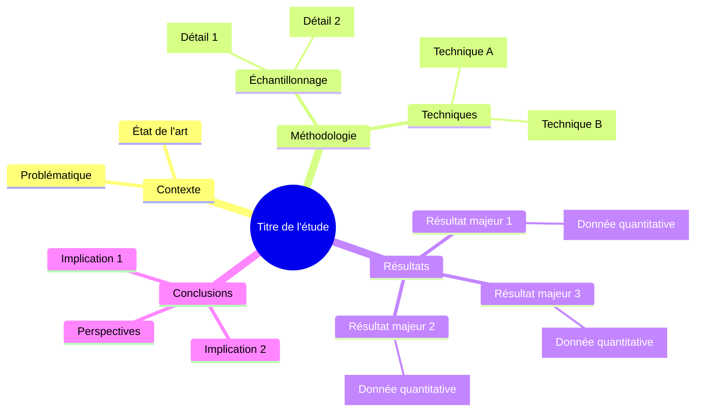

# Document Analyzer - Analyse de Documents Scientifiques

## Vue d'ensemble

Ce skill permet d'analyser en profondeur des documents scientifiques dans différents formats et de produire une synthèse structurée avec :
- Résumé exécutif concis
- Résultats majeurs extraits
- Conclusions principales
- Figures clés avec résultats quantitatifs
- Mindmap conceptuelle de synthèse (Mermaid)

## Formats supportés

- **PDF** : Articles scientifiques, rapports techniques
- **DOCX/Pages** : Manuscrits, documents Word/Pages
- **XLSX/Numbers** : Données tabulaires, résultats expérimentaux
- **PPTX/Keynote** : Présentations scientifiques

## Déclencheurs

- "analyse ce document"
- "résume cet article scientifique"
- "extrais les résultats principaux"
- "quelles sont les conclusions de ce PDF ?"
- "fais-moi une synthèse de ce rapport"
- "crée un schéma de synthèse"
- "extrais les figures importantes"

## Workflow d'analyse

### Étape 1 : Lecture du document

**1.1 Identifier le format**
```bash
# Vérifier l'extension
file <chemin_document>
```

**1.2 Lire selon le format**

Pour **PDF** :
```python
# Utiliser pdfplumber pour extraction texte + tables
import pdfplumber
import fitz  # PyMuPDF pour les images

with pdfplumber.open("document.pdf") as pdf:
    # Extraire le texte complet
    full_text = ""
    for page in pdf.pages:
        full_text += page.extract_text()
    
    # Extraire les tables
    tables = []
    for page in pdf.pages:
        tables.extend(page.extract_tables())
```

Pour **DOCX** :
```python
# Utiliser python-docx
from docx import Document
import mammoth

# Méthode 1 : python-docx (structure)
doc = Document("document.docx")
full_text = "\n".join([para.text for para in doc.paragraphs])

# Méthode 2 : mammoth (avec images)
with open("document.docx", "rb") as docx_file:
    result = mammoth.convert_to_html(docx_file)
    html_content = result.value
```

Pour **XLSX** :
```python
# Utiliser pandas
import pandas as pd

# Lire toutes les feuilles
xl_file = pd.ExcelFile("data.xlsx")
sheets = {sheet: xl_file.parse(sheet) for sheet in xl_file.sheet_names}
```

Pour **PPTX** :
```python
# Utiliser python-pptx
from pptx import Presentation

prs = Presentation("slides.pptx")
text_runs = []
for slide in prs.slides:
    for shape in slide.shapes:
        if hasattr(shape, "text"):
            text_runs.append(shape.text)
```

**1.3 Inventorier le contenu**

Créer une structure de métadonnées :
```python
document_meta = {
    "title": "",
    "authors": [],
    "sections": [],
    "figures_count": 0,
    "tables_count": 0,
    "pages": 0
}
```

### Étape 2 : Analyse structurée

**2.1 Identifier la structure du document**

Pour un article scientifique typique, rechercher :
- **Abstract/Résumé** : mots-clés "abstract", "résumé", "summary"
- **Introduction** : première section après l'abstract
- **Matériel et Méthodes** : "methods", "materials", "methodology"
- **Résultats** : "results", "findings", "observations"
- **Discussion** : "discussion", "interpretation"
- **Conclusion** : "conclusion", "concluding remarks"
- **Références** : "references", "bibliography"

**2.2 Extraction intelligente**

```python
import re

def extract_sections(text):
    """Découpe le texte en sections basé sur les titres."""
    # Regex pour détecter les titres de sections
    section_pattern = r'^#+\s+(.+)|^([A-Z][A-Za-z\s]+)$'
    
    sections = {}
    current_section = "Introduction"
    current_text = []
    
    for line in text.split('\n'):
        if re.match(section_pattern, line):
            # Sauvegarder la section précédente
            if current_text:
                sections[current_section] = '\n'.join(current_text)
            # Nouvelle section
            current_section = line.strip('#').strip()
            current_text = []
        else:
            current_text.append(line)
    
    # Dernière section
    if current_text:
        sections[current_section] = '\n'.join(current_text)
    
    return sections
```

**2.3 Extraire les informations clés**

```python
def extract_key_findings(results_section):
    """Extraire les résultats majeurs d'une section."""
    findings = []
    
    # Chercher des patterns de résultats
    patterns = [
        r'(significantly|p\s*[<>=]\s*0\.\d+)',  # Statistiques
        r'(\d+\.?\d*\s*%)',  # Pourcentages
        r'(increased|decreased|reduced|enhanced)\s+by\s+(\d+)',  # Variations
        r'(correlation|association)\s+.*\s+(r\s*=\s*0\.\d+)',  # Corrélations
    ]
    
    for pattern in patterns:
        matches = re.findall(pattern, results_section, re.IGNORECASE)
        findings.extend(matches)
    
    return findings
```

### Étape 3 : Extraction des figures importantes

**3.1 Identifier les figures avec résultats clés**

Critères de sélection :
- Figures dans la section "Résultats"
- Graphiques avec données quantitatives (barres, lignes, scatter)
- Tableaux avec résultats statistiques
- Schémas méthodologiques principaux

**3.2 Extraction des images (PDF)**

```python
import fitz  # PyMuPDF
from PIL import Image
import io

def extract_key_figures(pdf_path, output_dir):
    """Extraire les figures importantes d'un PDF."""
    doc = fitz.open(pdf_path)
    figures = []
    
    for page_num in range(len(doc)):
        page = doc[page_num]
        image_list = page.get_images(full=True)
        
        for img_index, img in enumerate(image_list):
            xref = img[0]
            base_image = doc.extract_image(xref)
            image_bytes = base_image["image"]
            
            # Filtrer par taille (éviter les logos, icônes)
            img_pil = Image.open(io.BytesIO(image_bytes))
            width, height = img_pil.size
            
            if width > 300 and height > 200:  # Seuil minimal
                # Sauvegarder
                img_filename = f"figure_{page_num+1}_{img_index+1}.png"
                img_path = f"{output_dir}/{img_filename}"
                img_pil.save(img_path)
                
                figures.append({
                    "filename": img_filename,
                    "page": page_num + 1,
                    "size": (width, height)
                })
    
    return figures
```

**3.3 Extraction des tableaux (PDF)**

```python
import pdfplumber

def extract_key_tables(pdf_path):
    """Extraire les tableaux avec résultats."""
    tables_data = []
    
    with pdfplumber.open(pdf_path) as pdf:
        for page_num, page in enumerate(pdf.pages):
            tables = page.extract_tables()
            
            for table_index, table in enumerate(tables):
                if table and len(table) > 2:  # Au moins 3 lignes
                    # Convertir en DataFrame pour analyse
                    import pandas as pd
                    df = pd.DataFrame(table[1:], columns=table[0])
                    
                    # Vérifier si contient des données numériques
                    has_numbers = df.applymap(lambda x: bool(re.search(r'\d', str(x)))).any().any()
                    
                    if has_numbers:
                        tables_data.append({
                            "page": page_num + 1,
                            "data": df,
                            "id": f"table_{page_num+1}_{table_index+1}"
                        })
    
    return tables_data
```

### Étape 4 : Génération du résumé exécutif

**4.1 Structure du résumé**

```markdown
# Résumé Exécutif

## Contexte
[1-2 phrases sur le problème scientifique adressé]

## Objectif
[Objectif principal de l'étude]

## Méthodologie
[Approche utilisée en 2-3 phrases]

## Résultats Principaux
- [Résultat 1 avec donnée quantitative]
- [Résultat 2 avec donnée quantitative]
- [Résultat 3 avec donnée quantitative]

## Conclusion
[Implication principale et portée des résultats]
```

**4.2 Règles de rédaction**

- **Longueur** : 150-250 mots maximum
- **Ton** : Factuel, scientifique, précis
- **Données** : Inclure les valeurs quantitatives clés (p-values, pourcentages, ratios)
- **Langue** : Français (contexte utilisateur Marc)
- **Focus** : Résultats > Méthodologie

### Étape 5 : Création de la mindmap Mermaid

**5.1 Structure conceptuelle**

Organiser les concepts selon :
- **Noyau central** : Question de recherche / Objectif
- **Branches principales** : Méthodologie, Résultats, Conclusions
- **Sous-branches** : Détails et résultats spécifiques

**5.2 Syntaxe Mermaid**



**5.3 Génération automatique**

```python
def generate_mindmap(sections, key_findings):
    """Générer une mindmap Mermaid à partir de l'analyse."""
    
    mindmap = "```mermaid\nmindmap\n"
    
    # Titre central
    title = sections.get('title', 'Étude scientifique')
    mindmap += f"  root(({title}))\n"
    
    # Branche Méthodologie
    if 'Methods' in sections or 'Methodology' in sections:
        mindmap += "    Méthodologie\n"
        methods = sections.get('Methods', sections.get('Methodology', ''))
        # Extraire 2-3 points clés
        method_points = extract_key_points(methods, n=3)
        for point in method_points:
            mindmap += f"      {point}\n"
    
    # Branche Résultats
    mindmap += "    Résultats\n"
    for finding in key_findings[:5]:  # Top 5 résultats
        mindmap += f"      {finding}\n"
    
    # Branche Conclusions
    if 'Conclusion' in sections or 'Discussion' in sections:
        mindmap += "    Conclusions\n"
        conclusion = sections.get('Conclusion', sections.get('Discussion', ''))
        conclusion_points = extract_key_points(conclusion, n=3)
        for point in conclusion_points:
            mindmap += f"      {point}\n"
    
    mindmap += "```\n"
    return mindmap
```

### Étape 6 : Génération du rapport Markdown

**6.1 Template du rapport**

```markdown
# Analyse : [Titre du Document]

**Date d'analyse** : [Date]  
**Format source** : [PDF/DOCX/XLSX/PPTX]  
**Pages** : [Nombre]

---

## 📋 Résumé Exécutif

[Contenu du résumé exécutif de l'étape 4]

---

## 🔬 Résultats Majeurs

1. **[Résultat 1]**
   - Donnée quantitative : [valeur]
   - Signification : [p-value ou autre]

2. **[Résultat 2]**
   - Donnée quantitative : [valeur]
   - Signification : [p-value ou autre]

[...]

---

## 💡 Conclusions Principales

- **[Conclusion 1]** : [Description]
- **[Conclusion 2]** : [Description]
- **[Conclusion 3]** : [Description]

---

## 📊 Figures Clés

### Figure 1 : [Titre]


**Description** : [Ce que montre la figure]  
**Résultat clé** : [Donnée principale extraite]

### Tableau 1 : [Titre]
[Tableau formaté en Markdown]

**Interprétation** : [Ce que révèle le tableau]

---

## 🗺️ Mindmap Conceptuelle

[Mindmap Mermaid générée à l'étape 5]

---

## 📎 Métadonnées

- **Auteurs** : [Liste]
- **Journal/Source** : [Source]
- **Année** : [Année]
- **DOI** : [DOI si disponible]

---

*Analyse générée automatiquement par Document Analyzer*
```

**6.2 Création du fichier**

```python
def create_analysis_report(document_path, output_dir):
    """Pipeline complet d'analyse."""
    
    # 1. Lire le document
    doc_content = read_document(document_path)
    
    # 2. Analyser la structure
    sections = extract_sections(doc_content)
    
    # 3. Extraire résultats et conclusions
    key_findings = extract_key_findings(sections.get('Results', ''))
    conclusions = extract_conclusions(sections.get('Conclusion', ''))
    
    # 4. Extraire les figures
    figures_dir = f"{output_dir}/figures"
    os.makedirs(figures_dir, exist_ok=True)
    figures = extract_key_figures(document_path, figures_dir)
    tables = extract_key_tables(document_path)
    
    # 5. Générer le résumé exécutif
    executive_summary = generate_executive_summary(sections, key_findings)
    
    # 6. Générer la mindmap
    mindmap = generate_mindmap(sections, key_findings)
    
    # 7. Compiler le rapport
    report = compile_report(
        title=sections.get('title', 'Document Analysis'),
        summary=executive_summary,
        findings=key_findings,
        conclusions=conclusions,
        figures=figures,
        tables=tables,
        mindmap=mindmap
    )
    
    # 8. Sauvegarder
    report_path = f"{output_dir}/analyse_document.md"
    with open(report_path, 'w', encoding='utf-8') as f:
        f.write(report)
    
    return report_path
```

### Étape 7 : Gestion multi-format

**7.1 Convertir Pages/Numbers/Keynote (macOS)**

```bash
# Utiliser LibreOffice en ligne de commande
soffice --headless --convert-to pdf document.pages --outdir /tmp/

# Ou utiliser pandoc pour certains formats
pandoc document.docx -o document.pdf
```

**7.2 Pipeline unifié**

```python
def analyze_any_document(file_path):
    """Point d'entrée unique pour tous les formats."""
    
    ext = os.path.splitext(file_path)[1].lower()
    
    # Convertir si nécessaire
    if ext in ['.pages', '.numbers', '.key']:
        # Conversion macOS
        converted_path = convert_iwork_to_pdf(file_path)
        file_path = converted_path
        ext = '.pdf'
    
    # Analyser selon le format
    if ext == '.pdf':
        return analyze_pdf(file_path)
    elif ext in ['.docx', '.doc']:
        return analyze_docx(file_path)
    elif ext in ['.xlsx', '.xls']:
        return analyze_xlsx(file_path)
    elif ext in ['.pptx', '.ppt']:
        return analyze_pptx(file_path)
    else:
        raise ValueError(f"Format non supporté : {ext}")
```

## Instructions spécifiques pour Marc

### Contexte scientifique

- **Domaine** : Microbiologie marine, océanographie
- **Types de documents fréquents** :
  - Articles de recherche (métabarcoding, haute pression, écologie microbienne)
  - Rapports techniques (instrumentation, protocoles expérimentaux)
  - Présentations de résultats (conférences, réunions d'équipe)

### Adaptations contextuelles

**Terminologie** :
- Reconnaître la nomenclature taxonomique (16S rRNA, ASV, OTU)
- Identifier les méthodes statistiques courantes (PERMANOVA, betadisper, ANCOM-BC2)
- Extraire les conditions expérimentales (pression, température, profondeur)

**Figures prioritaires** :
- Graphiques de diversité alpha/beta
- PCoA plots, NMDS
- Diagrammes de Venn (ASV partagés)
- Courbes de raréfaction
- Heatmaps taxonomiques
- Graphiques de abondance différentielle

**Langue** :
- Rapport en français par défaut
- Conserver les termes techniques en anglais (noms de méthodes, packages R)
- Citations et références en langue originale

## Dépendances

**Python packages requis** :
```bash
pip install pdfplumber PyMuPDF python-docx pandas openpyxl python-pptx Pillow mammoth --break-system-packages
```

**Outils système** :
- `poppler-utils` (pour pdftotext en fallback)
- `LibreOffice` (pour conversion iWork sur macOS)

## Exemples d'utilisation

### Exemple 1 : Analyser un PDF scientifique

```bash
# L'utilisateur upload un PDF
# → Le skill détecte automatiquement et analyse
```

**Commande utilisateur** :
> "Analyse cet article sur le métabarcoding des archaea"

**Actions du skill** :
1. Lire le PDF avec pdfplumber
2. Identifier les sections (Abstract, Methods, Results, Discussion)
3. Extraire les résultats clés (abondances, diversité, statistiques)
4. Sauvegarder les figures (PCoA, barplots, heatmaps)
5. Générer un résumé exécutif en français
6. Créer une mindmap conceptuelle
7. Compiler le rapport Markdown
8. Présenter le fichier final

### Exemple 2 : Comparer deux études

```bash
# Upload de 2 PDFs
```

**Commande utilisateur** :
> "Compare ces deux articles et extrais les différences méthodologiques"

**Actions du skill** :
1. Analyser les deux documents séparément
2. Extraire les sections "Methods" de chacun
3. Comparer les approches (échantillonnage, séquençage, analyses)
4. Générer un tableau comparatif
5. Créer une mindmap comparative

### Exemple 3 : Extraire uniquement les figures d'une présentation

**Commande utilisateur** :
> "Extrais toutes les figures de résultats de ce PowerPoint"

**Actions du skill** :
1. Lire le PPTX
2. Identifier les slides avec graphiques
3. Extraire les images > 300x200 px
4. Sauvegarder dans ./figures/
5. Générer un index Markdown avec aperçu

## Limitations connues

- **PDFs scannés** : Nécessitent OCR (pytesseract) pour extraction texte
- **Formats propriétaires** : Pages/Numbers/Keynote nécessitent macOS pour conversion native
- **Équations mathématiques** : Extraction limitée, peuvent apparaître comme symboles
- **Tableaux complexes** : Fusion de cellules peut créer des artefacts

## Améliorations futures

- [ ] Support OCR pour PDFs scannés
- [ ] Extraction de bibliographie structurée (BibTeX)
- [ ] Détection automatique du type d'étude (expérimentale, méta-analyse, revue)
- [ ] Export en format Quarto pour intégration site web
- [ ] Analyse comparative multi-documents
- [ ] Extraction de métadonnées avancées (funding, affiliations, keywords)

---

*Skill créé pour Marc Garel - MIO/OSU Marseille*  
*Version 1.0 - Avril 2024*
