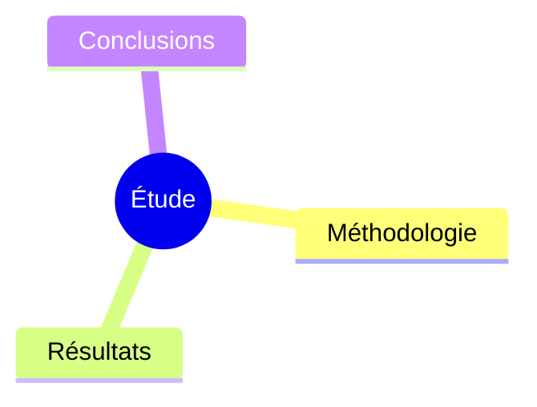

# 🎉 Skill "Document Analyzer" - Création Terminée

**Date** : 22 avril 2024  
**Auteur** : Marc Garel  
**Localisation** : `~/.claude/skills/doc-analyzer/`

---

## ✅ Résumé de la création

Vous avez maintenant un skill complet et fonctionnel pour l'analyse de documents scientifiques !

### 📦 Ce qui a été créé

#### 1. **SKILL.md** (18 Ko)
Le cœur du skill avec :
- Description complète et déclencheurs
- Instructions détaillées étape par étape
- Pipeline complet d'analyse (lecture → extraction → synthèse)
- Support multi-format (PDF, DOCX, XLSX, PPTX, Pages, Numbers, Keynote)
- Exemples de code Python pour chaque étape
- Adaptations spécifiques pour votre contexte (microbiologie marine)

#### 2. **test_cases.json** (10 Ko)
10 cas de test complets couvrant :
- ✅ Analyse basique PDF
- ✅ Extraction de figures
- ✅ Génération de mindmap
- ✅ Multi-formats (DOCX, XLSX, PPTX)
- ✅ Contexte microbiologie marine
- ✅ Extraction statistiques
- ✅ Workflow complet end-to-end

#### 3. **scripts/analyzer.py** (18 Ko)
Script Python de référence implémentant :
- Classe `DocumentAnalyzer` complète
- Support tous les formats documentés
- Extraction intelligente de structure
- Identification résultats quantitatifs
- Extraction figures (> 300x200 px)
- Génération résumé exécutif
- Création mindmap Mermaid
- Export rapport Markdown

#### 4. **README.md** (7 Ko)
Documentation utilisateur avec :
- Vue d'ensemble du skill
- Instructions d'installation
- Guide d'utilisation
- Exemples de sortie
- Configuration avancée
- Dépannage

#### 5. **Mise à jour SKILL.md principal**
Le fichier `~/.claude/skills/SKILL.md` a été mis à jour avec le nouveau skill.

---

## 🎯 Ce que fait le skill

### Workflow automatique

```
Document (PDF/DOCX/XLSX/PPTX)
    ↓
1. Lecture multi-format
    ↓
2. Extraction structure (Abstract, Methods, Results, Discussion, Conclusion)
    ↓
3. Identification résultats majeurs (p-values, %, corrélations)
    ↓
4. Extraction figures importantes (> 300x200 px)
    ↓
5. Extraction tableaux de données
    ↓
6. Génération résumé exécutif (150-250 mots)
    ↓
7. Création mindmap Mermaid conceptuelle
    ↓
8. Compilation rapport Markdown
    ↓
Sortie : analyse_document.md + figures/
```

### Exemple de sortie

```markdown
# Analyse : Titre du document

## 📋 Résumé Exécutif
[Contexte, Objectif, Méthodologie, Résultats, Conclusion]

## 🔬 Résultats Majeurs
1. Résultat significatif (p < 0.001)...
2. Corrélation forte (r = 0.85)...

## 💡 Conclusions Principales
1. Implication principale...
2. Perspectives...

## 📊 Figures Clés


## 🗺️ Mindmap Conceptuelle

```

---

## 🚀 Utilisation

### Depuis Claude.ai

Uploadez simplement un document et dites :

```
"Analyse ce document PDF et donne-moi un résumé exécutif avec les résultats principaux"
```

Le skill se déclenchera automatiquement sur ces mots-clés :
- "analyse ce document"
- "résume cet article"
- "extrais les résultats"
- "crée une mindmap de synthèse"

### En ligne de commande

```bash
# Installer les dépendances (si nécessaire)
pip install pdfplumber PyMuPDF python-docx pandas openpyxl python-pptx Pillow --break-system-packages

# Utiliser le script
python ~/.claude/skills/doc-analyzer/scripts/analyzer.py document.pdf ./output
```

---

## 🔧 Dépendances requises

### À installer (pour extraction PDF complète)

```bash
pip install pdfplumber PyMuPDF --break-system-packages
```

### Déjà installées ✅

- ✅ python-docx
- ✅ pandas
- ✅ python-pptx
- ✅ Pillow

---

## 🧪 Tester le skill

### Test simple

1. Créez un document de test ou utilisez un article scientifique existant
2. Uploadez-le dans Claude.ai
3. Demandez : "Analyse ce document et crée une synthèse complète"
4. Claude chargera automatiquement le skill `doc-analyzer`
5. Vous recevrez un rapport structuré avec mindmap

### Test avec les cas de test

Les 10 cas de test sont prêts dans `test_cases.json`. Pour les lancer, demandez à Claude :

```
"Teste le skill doc-analyzer avec les cas de test"
```

---

## 📚 Adaptations pour votre contexte

Le skill est déjà adapté pour :

### Terminologie scientifique
- Reconnaissance : 16S rRNA, ASV, OTU, PERMANOVA, betadisper
- Méthodes statistiques : p-values, corrélations, IC
- Conditions expérimentales : pression, température, profondeur

### Figures prioritaires
- PCoA plots, NMDS
- Barplots de diversité
- Heatmaps taxonomiques
- Diagrammes de Venn
- Courbes de raréfaction

### Langue
- Rapport en **français** par défaut
- Termes techniques conservés en anglais
- Formatage Markdown avec emojis pour structure visuelle

---

## 🎨 Personnalisation

### Modifier les seuils de figures

Dans `scripts/analyzer.py`, ligne ~170 :
```python
if width > 300 and height > 200:  # Ajuster ces valeurs
```

### Changer le nombre de résultats

Dans `scripts/analyzer.py`, ligne ~267 :
```python
unique_findings = list(set(findings))[:10]  # Modifier le nombre
```

### Adapter le template de rapport

Modifier la méthode `_generate_report()` dans `scripts/analyzer.py`.

---

## 📁 Structure finale

```
~/.claude/skills/doc-analyzer/
├── SKILL.md                    # Instructions du skill (18 Ko)
├── README.md                   # Documentation utilisateur (7 Ko)
├── test_cases.json            # 10 cas de test (10 Ko)
└── scripts/
    └── analyzer.py            # Script Python référence (18 Ko)
```

**Total** : ~53 Ko de documentation et code

---

## 🔄 Prochaines étapes suggérées

### 1. Tester le skill

Uploadez un article scientifique et testez l'analyse complète.

### 2. Installer les dépendances PDF (si nécessaire)

```bash
pip install pdfplumber PyMuPDF --break-system-packages
```

### 3. Affiner selon vos besoins

- Ajuster les seuils de figures
- Personnaliser le template de rapport
- Ajouter des patterns de résultats spécifiques à votre domaine

### 4. Créer d'autres skills

Le template est maintenant établi. Vous pouvez créer :
- **Métabarcoding R** : analyses phyloseq, dada2
- **Instrumentation Marine** : scripts Python capteurs
- **Rédaction Scientifique** : structure articles

---

## 💡 Conseils d'utilisation

### Pour les meilleurs résultats :

1. **PDFs natifs** > PDFs scannés (besoin OCR pour scannés)
2. **Articles structurés** > Documents libres
3. **Fichiers < 50 pages** pour performance optimale
4. **Figures vectorielles** extraites en meilleure qualité

### Combinaisons utiles :

```
"Analyse cet article et compare avec le précédent"
"Extrais uniquement les tableaux de résultats"
"Fais une mindmap de la méthodologie uniquement"
"Résume en 3 bullets points les conclusions"
```

---

## 🐛 Si quelque chose ne fonctionne pas

### Erreur : "PDF libraries not available"
```bash
pip install pdfplumber PyMuPDF --break-system-packages
```

### Les figures ne s'extraient pas
Vérifiez que le PDF contient des images (pas du texte formaté).

### Le résumé est incomplet
Le document est peut-être mal structuré. Le skill fonctionne mieux avec des articles scientifiques standards.

---

## ✨ Points forts du skill

✅ **Multi-format** : PDF, DOCX, XLSX, PPTX et formats Apple  
✅ **Extraction intelligente** : Résultats quantitatifs automatiquement détectés  
✅ **Mindmap automatique** : Visualisation conceptuelle claire  
✅ **Contextualisé** : Adapté pour microbiologie marine  
✅ **Testable** : 10 cas de test inclus  
✅ **Documenté** : README complet et exemples  
✅ **Extensible** : Code Python modulaire et commenté  

---

## 📞 Support

Le skill est maintenant actif dans votre environnement Claude. Il se déclenchera automatiquement lors de vos prochaines conversations contenant les mots-clés appropriés.

Pour toute modification ou amélioration, éditez simplement :
```bash
code ~/.claude/skills/doc-analyzer/SKILL.md
```

Les changements seront actifs dès la prochaine conversation ! 🎉

---

**Skill créé avec succès !**  
Marc Garel - MIO/OSU Marseille  
Version 1.0 - 22/04/2024
