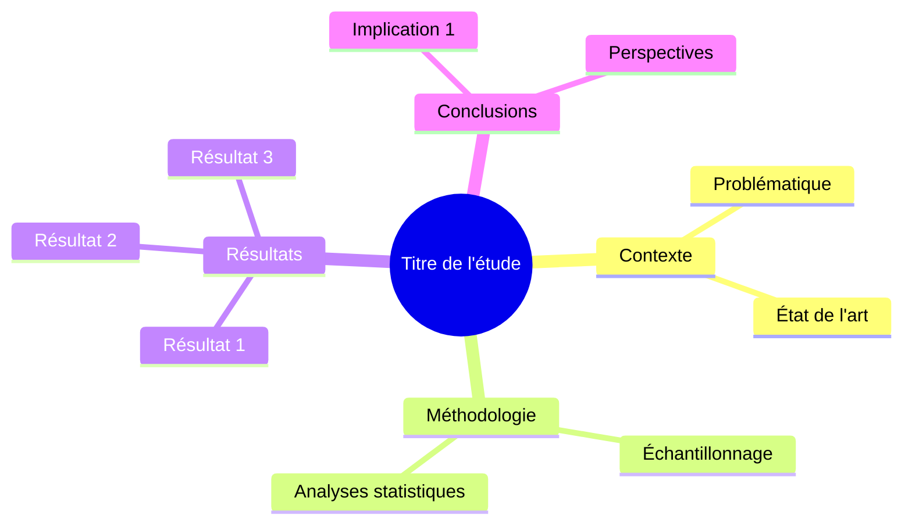

# Document Analyzer Skill

Skill d'analyse approfondie de documents scientifiques avec extraction automatique de résultats, figures et génération de synthèse conceptuelle.

## 📋 Vue d'ensemble

Ce skill permet d'analyser des documents scientifiques dans différents formats (PDF, DOCX, XLSX, PPTX, Pages, Numbers, Keynote) et de produire :

- ✅ **Résumé exécutif** structuré (150-250 mots)
- ✅ **Résultats majeurs** avec données quantitatives
- ✅ **Conclusions principales** extraites
- ✅ **Figures importantes** sauvegardées (> 300x200 px)
- ✅ **Mindmap Mermaid** de synthèse conceptuelle
- ✅ **Rapport Markdown** complet et structuré

## 🚀 Installation

### Dépendances Python

```bash
pip install pdfplumber PyMuPDF python-docx pandas openpyxl python-pptx Pillow --break-system-packages
```

### Vérifier l'installation

```bash
python ~/.claude/skills/doc-analyzer/scripts/analyzer.py --help
```

## 📖 Utilisation

### Depuis Claude.ai

Uploadez simplement un document et demandez :

```
"Analyse ce document PDF et donne-moi un résumé exécutif avec les résultats principaux"
```

ou

```
"Extrais les figures importantes et crée une mindmap de synthèse"
```

### En ligne de commande

```bash
python ~/.claude/skills/doc-analyzer/scripts/analyzer.py document.pdf ./output
```

## 🎯 Déclencheurs

Le skill se déclenche automatiquement quand vous utilisez :

- "analyse ce document"
- "résume cet article scientifique"
- "extrais les résultats principaux"
- "quelles sont les conclusions de ce PDF ?"
- "fais-moi une synthèse de ce rapport"
- "crée un schéma de synthèse"
- "extrais les figures importantes"

## 📁 Structure des fichiers

```
doc-analyzer/
├── SKILL.md                    # Instructions du skill
├── README.md                   # Cette documentation
├── test_cases.json            # Cas de test
└── scripts/
    └── analyzer.py            # Script Python de référence
```

## 📊 Formats supportés

| Format | Extension | Extraction texte | Extraction figures | Extraction tableaux |
|--------|-----------|------------------|-------------------|---------------------|
| PDF | `.pdf` | ✅ | ✅ | ✅ |
| Word | `.docx`, `.doc` | ✅ | ⚠️ Partiel | ⚠️ Partiel |
| Excel | `.xlsx`, `.xls` | ✅ | ❌ | ✅ |
| PowerPoint | `.pptx`, `.ppt` | ✅ | ⚠️ Partiel | ⚠️ Partiel |
| Pages | `.pages` | 🔄 Via conversion | 🔄 Via conversion | 🔄 Via conversion |
| Numbers | `.numbers` | 🔄 Via conversion | ❌ | 🔄 Via conversion |
| Keynote | `.key` | 🔄 Via conversion | 🔄 Via conversion | ❌ |

**Légende** : ✅ Complet | ⚠️ Partiel | ❌ Non supporté | 🔄 Nécessite conversion

## 🔬 Exemple de sortie

### Structure du rapport généré

```markdown
# Analyse : Titre du document

**Date d'analyse** : 22/04/2024
**Sections identifiées** : 6
**Figures extraites** : 4
**Tableaux extraits** : 2

---

## 📋 Résumé Exécutif

**Contexte** : [Problématique scientifique]

**Objectif** : [Objectif de l'étude]

**Méthodologie** : [Approche utilisée]

**Résultats Principaux** :
1. [Résultat 1 avec valeur quantitative]
2. [Résultat 2 avec valeur quantitative]
3. [Résultat 3 avec valeur quantitative]

**Conclusion** : [Implication principale]

---

## 🔬 Résultats Majeurs

1. L'analyse révèle une augmentation significative (p < 0.001)...
2. La corrélation entre X et Y est forte (r = 0.85)...

---

## 💡 Conclusions Principales

1. Les résultats démontrent que...
2. Cette étude ouvre de nouvelles perspectives...

---

## 📊 Figures Clés

### Figure 1


**Page** : 3 | **Dimensions** : 600x400 px

---

## 🗺️ Mindmap Conceptuelle



---

*Analyse générée automatiquement par Document Analyzer*
```

## 🧪 Tests

Le skill inclut 10 cas de test couvrant :

1. ✅ Analyse basique PDF
2. ✅ Extraction de figures
3. ✅ Génération de mindmap
4. ✅ Analyse DOCX
5. ✅ Extraction XLSX
6. ✅ Analyse PPTX
7. ✅ Contexte microbiologie marine
8. ✅ Sortie en français
9. ✅ Extraction statistiques
10. ✅ Workflow complet

### Lancer les tests

```bash
# Depuis Claude.ai
"Teste le skill doc-analyzer avec les cas de test"
```

## 🎨 Personnalisation

### Adapter pour votre domaine

Modifiez la section "Instructions spécifiques" dans `SKILL.md` :

```markdown
### Terminologie personnalisée
- Termes techniques : [vos termes]
- Méthodes statistiques : [vos méthodes]
- Figures prioritaires : [vos types de figures]
```

### Modifier le template de rapport

Éditez la méthode `_generate_report()` dans `scripts/analyzer.py`.

## ⚙️ Configuration avancée

### Filtres de figures

Par défaut, seules les figures > 300x200 px sont extraites. Modifier dans `analyzer.py` :

```python
if width > 300 and height > 200:  # Ajuster ces valeurs
```

### Nombre de résultats

Limiter le nombre de résultats extraits :

```python
findings = self._find_key_results(results_text)[:5]  # Top 5
```

## 🐛 Dépannage

### Erreur : "PDF libraries not available"

```bash
pip install pdfplumber PyMuPDF --break-system-packages
```

### Erreur : "python-docx not installed"

```bash
pip install python-docx --break-system-packages
```

### Les figures ne s'extraient pas

Vérifiez que Pillow est installé :
```bash
pip install Pillow --break-system-packages
```

### Conversion Pages/Numbers/Keynote échoue

Sur macOS, utilisez LibreOffice :
```bash
brew install libreoffice
soffice --headless --convert-to pdf document.pages
```

## 📝 Notes importantes

### Limitations

- **PDFs scannés** : Nécessitent OCR (non inclus)
- **Formats Apple** : Conversion nécessite macOS ou LibreOffice
- **Équations** : Extraction limitée
- **Tableaux complexes** : Fusion de cellules peut créer des artefacts

### Données privées

- Les documents sont analysés localement
- Aucune donnée n'est envoyée à des services externes
- Les fichiers de sortie sont sauvegardés dans `./document_analysis/`

## 🔄 Changelog

### Version 1.0 (2024-04-22)
- ✅ Support PDF, DOCX, XLSX, PPTX
- ✅ Extraction texte et structure
- ✅ Extraction figures et tableaux
- ✅ Génération résumé exécutif
- ✅ Création mindmap Mermaid
- ✅ Rapport Markdown complet
- ✅ 10 cas de test

## 🤝 Contribution

Ce skill est personnalisé pour Marc Garel (MIO/OSU Marseille) mais peut être adapté pour d'autres contextes scientifiques.

Pour suggérer des améliorations :
1. Identifier le besoin
2. Modifier `SKILL.md` ou `analyzer.py`
3. Tester avec les cas de test existants

## 📚 Ressources

- [pdfplumber documentation](https://github.com/jsvine/pdfplumber)
- [PyMuPDF documentation](https://pymupdf.readthedocs.io/)
- [python-docx documentation](https://python-docx.readthedocs.io/)
- [Mermaid mindmap syntax](https://mermaid.js.org/syntax/mindmap.html)

---

**Auteur** : Marc Garel  
**Organisation** : MIO/OSU Marseille  
**Licence** : Usage personnel  
**Version** : 1.0  
**Dernière mise à jour** : 22 avril 2024
